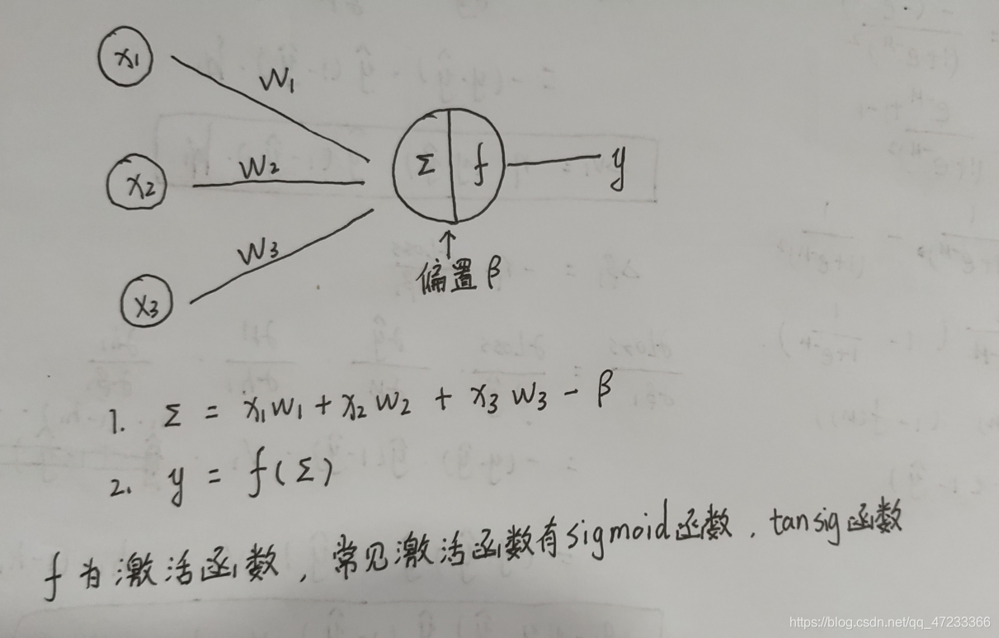
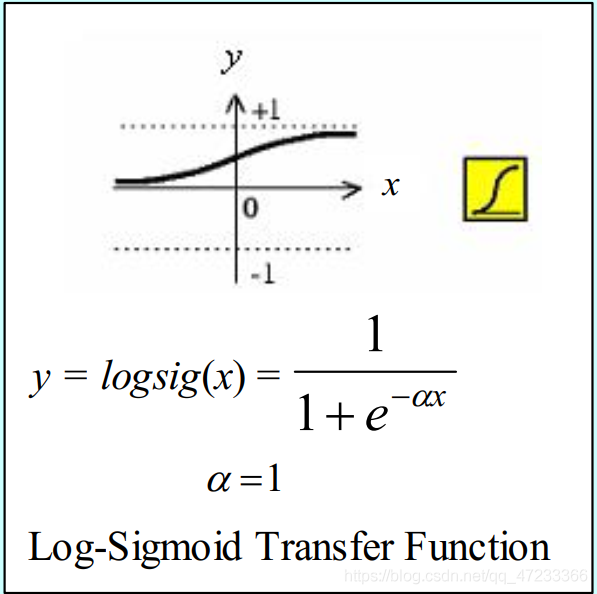
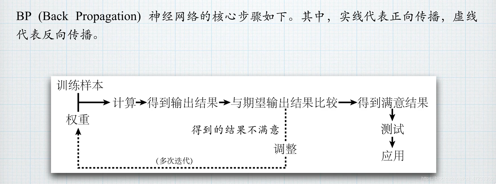
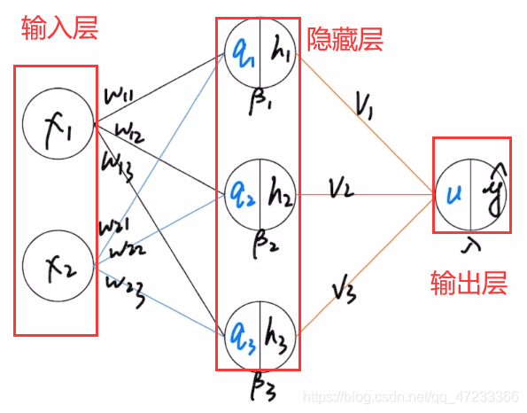

# 1. 简介

BP(back propagation)神经网络是1986年由Rumelhart和McClelland为首的科学家提出的概念，是一种按照误差逆向传播算法训练的多层前馈神经网络，是应用最广泛的神经网络。
BP网络是在输入层与输出层之间增加若干层(一层或多层)神经元，这些神经元称为隐单元，它们与外界没有直接的联系，但其状态的改变，则能影响输入与输出之间的关系，每一层可以有若干个节点。
# 2. 计算过程

神经网络图示基本含义

上图为神经网络的一部分，x1,x2,x3为外部输入，w1,w2,w3为这些输入的权重（表示这些输入的重要程度）。后面的大⚪相当与一个神经元，其中
$∑ = x_{1}w_{1} + x_{2}w_{2} + x_{3}w_{3} - β$( β为偏置) 
$$y = f(∑)$$ 
f为激活函数，最常见激活函数是Sigmoid函数，其图像及表达式如下图所示（本文后面所有激活函数都为Sigmoid函数）

## BP神经网络的整体流程

# 3. BP神经网络的实现流程
首先神经网络一共有三部分组成：输入层、隐藏层、输出层（其中隐藏层可以有多层，本图中只有一层）。图中输入层有两个神经元、隐藏层有三个神经元、输出层有一个神经元。我们通过计算可以得出ŷ的值（后文会有详细计算过程），这就是我们根据所给数据得到的输出结果，我们会将输出结果和预期结果进行比较（预期结果就是真实值），如果发现两个结果十分符合，那么表示我们所设置的期望和偏置是较优的，不需要进行修改（注：图中的期望w、v、β、λ都是我们自己事先设置的数值）；如果发现两个结果相差较大，这表面我们事先设置的参数不合适（w、v、β、λ），需要进行修改。这时候我们需要从后往前的算出这些参数的的变化量，然后更新参数的数值，重新计算输出，直到得到的输入结果和预期相符停止。

# 4.代码

