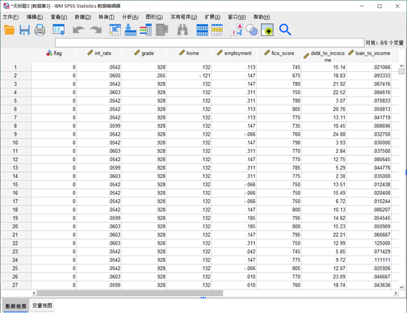
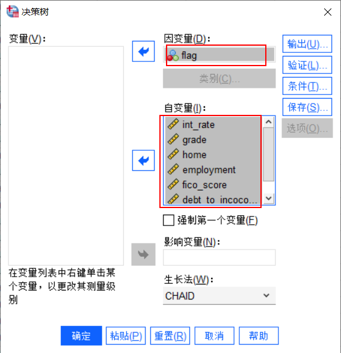

[toc]

 SPSS决策树分析是基于树的分类模型，它将个案分为若干组，或根据自变量（预测变量）的值预测因变量（目标变量）的值。它有易于理解、可以应用于小数据集、能够处理多输出的问题、对==缺失值不敏感==、==效率高==等优点。下面就讲解下SPSS决策树分析使用教程。

 ---
 # 1. 数据集准备

本例使用的是信用风险识别数据（来源Kaggle的项目），包括int_rate（贷款利率）、grade（贷款等级）、home（住房性质）、employment（职业）等八个指标，我们将通过SPSS软件使用这八个指标对数据个案进行决策树分析。

---

# 2. 决策树参数的设置
 - 点击SPSS主页顶部菜单栏“分析”-“分类”-“决策树”，即可打开决策树窗口。将flag加载到因变量文本框，将八个指标加载到自变量文本框。生长法选择CHAID（卡方自动交互检测），主要是利用卡方检测判断属性优先级。
 
  
  
  
  -  ==点击右侧的“验证”按钮，按照训练样本70%，检测样本30%的分配数据==

 - 为了方便结果的观察，点击右侧“保存”，勾选已保存的变量：终端节点数、预测值、预测概率、样本分配。

- 考虑到防止节点个案数太少而导致结果不准确，因此通过“条件”按钮，将最小个案树父节点设置为400、子节点设置为200。

    

---

# 3. 结果分析
   通过以上SPSS操作步骤，我们可以得到决策树分析的结果。

   +  模型摘要

   主要包括生长法、自变量、结果。在本案例中，经过筛选，最终将纳入的是fico_score指标，这意味着这个变量起到重要作用，实际业务操作过程中，我们应该重点关注这个指标。
   

   + 风险

   查看模型效果的重要依据之一，从风险表格中可以看到，训练估算0.061，表示在70%的训练样本中有6.1%的样本被错误归类。检验估算0.069，表示在30%的测试样本中有6.9%的样本被错误归类。
  

  

 + 分类

   查看模型效果的重要依据之一，从风险表格中可以看到，训练集93.9%，表示该模型正确率为93.9%。检验集表示在用训练集训练好的模型去检验测试集的数据，正确率为93.1%。

    
